# Lus server

Lus app

## Features

- Comming soon

### Tech

- express : ^4.17.1
- express-handlebars : ^5.2.0
- mongoose : ^5.10.3
- socket.io : ^2.3.0
- cloudinary : ^1.23.0

### Coding Rules

- Coding conventions: https://github.com/standard/standard

### Tools

### Installation

Open your favorite Terminal and run these commands.

```sh
$ git clone git@github.com:VTNPlusD/lus-server.git
$ cd lus-server
$ npm install
$ cp .env.example .env
```

### Setup MongoDb Database

- For managing MongoDB, click MongoDB Browser: https://www.mongodb.com/
- Database setup

  Create a new database and get mongodb uri

### Setup Cloudinary

- For managing cloud image, click Browser: https://www.cloudimage.io/
- Cloud setup
  
  Create and get cloudinary api key and cloudinary api secret

### Setup Google API NodeJS client

- Click Browser: https://github.com/googleapis/google-api-nodejs-client
  
  Create and get access token, client id, client secret, refresh token, email

### Config file .env

```sh
ACCESS_TOKEN=''
CLIENT_ID=''
CLIENT_SECRET=''
CLOUDINARY_API_KEY=''
CLOUDINARY_API_SECRET=''
EMAIL='vtnplusd@gmail.com'
HOST='0.0.0.0'
PORT='5000'
REFRESH_TOKEN=''
MONGODB_URI='mongodb+srv://<Username>:<Password>@mydb-unmzm.mongodb.net/<Name Project>?retryWrites=true&w=majority'
```

### Run app

```sh
$ npm start
```

### Run the test

```sh
$ npm test
```

### Run the nodemon

```sh
$ npm run dev
```

### Screen web admin

|                         |                         |
|        :---:            |          :---:          |
| 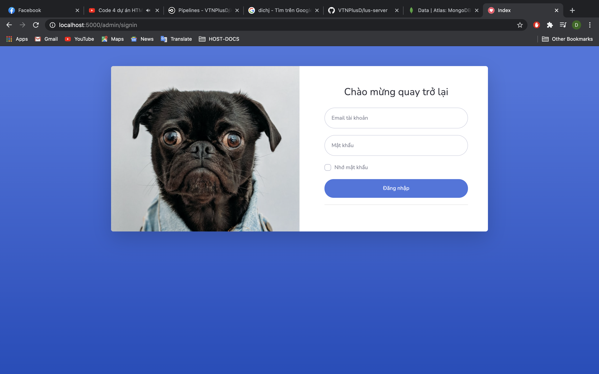 | 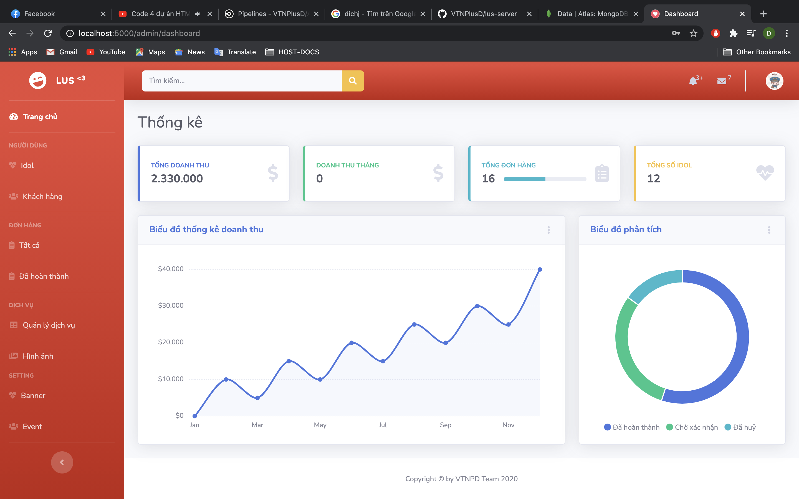 |
| 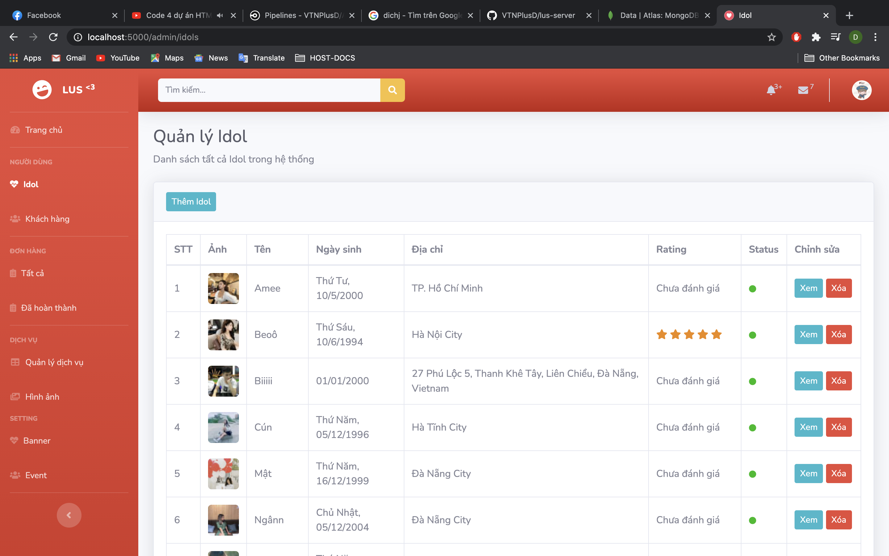 | 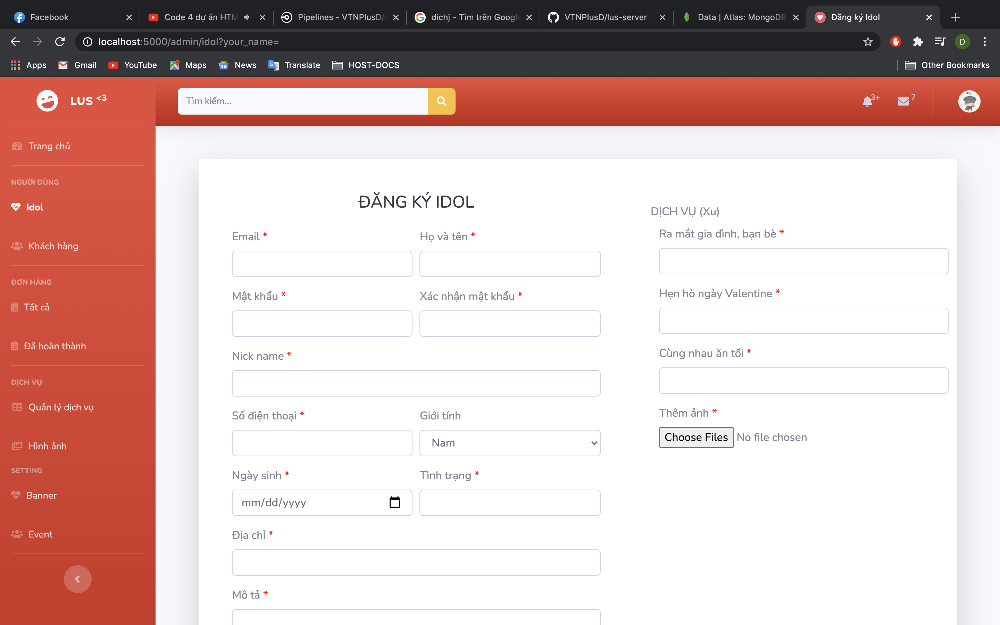 |
| 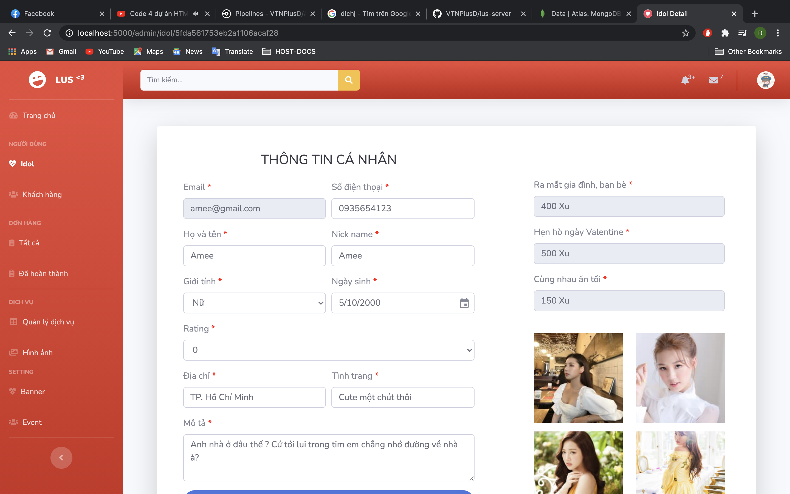 | 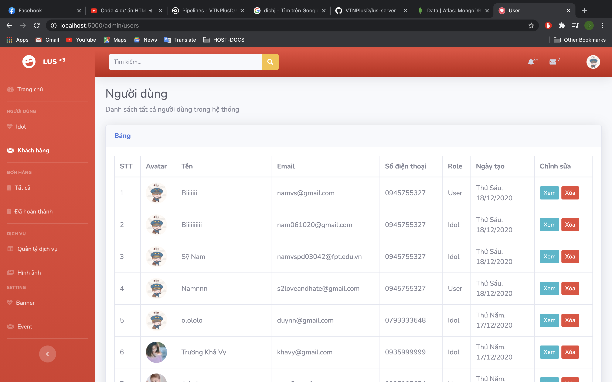 |
| 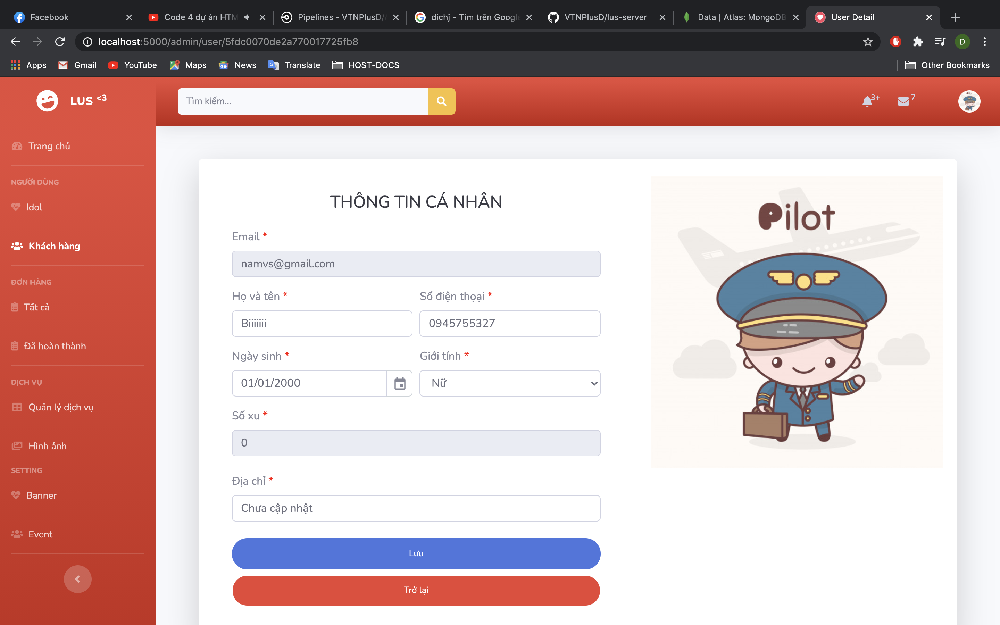 | 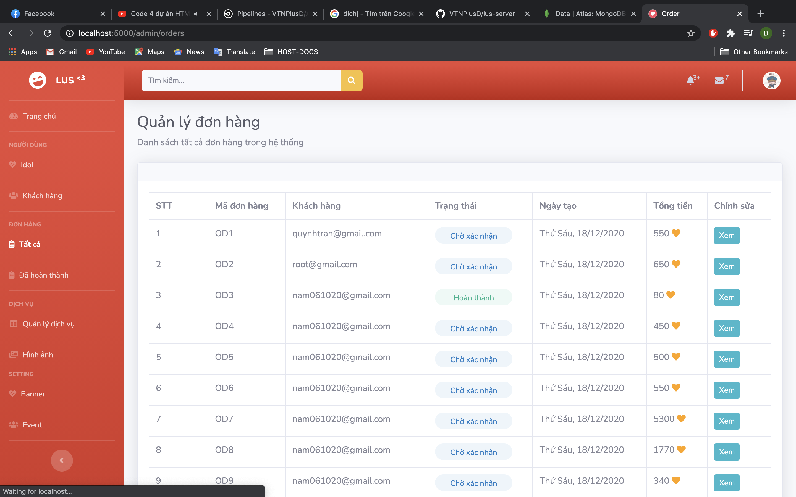 |
| 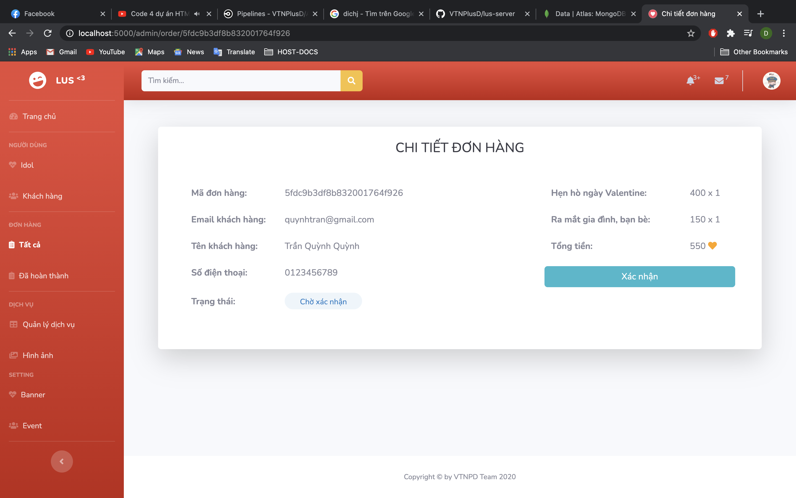 | 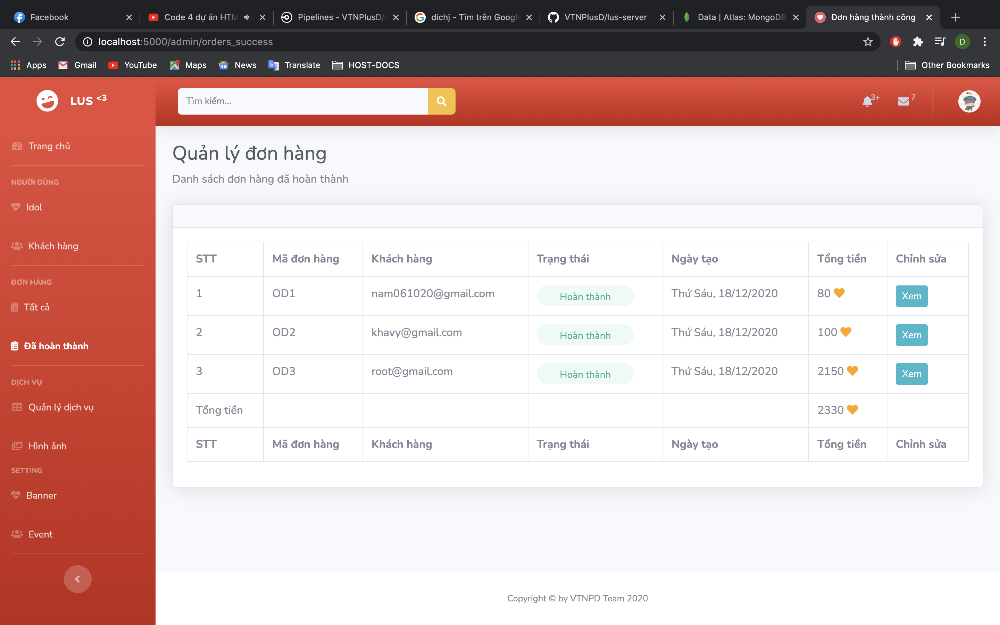 |
| 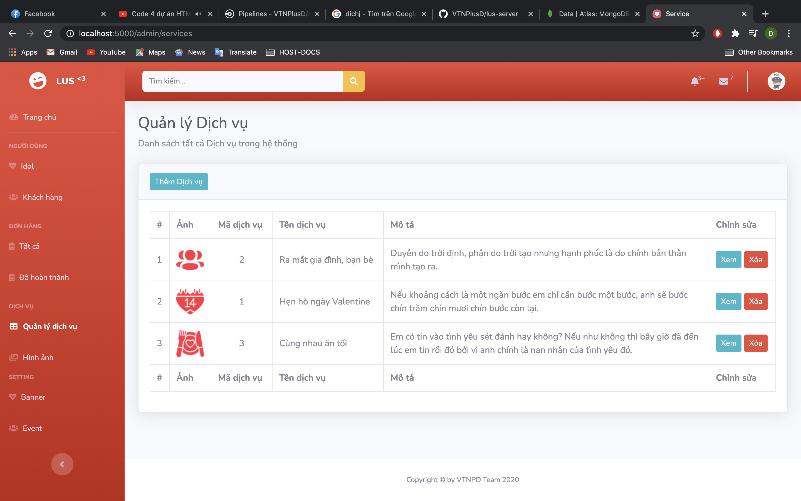 | 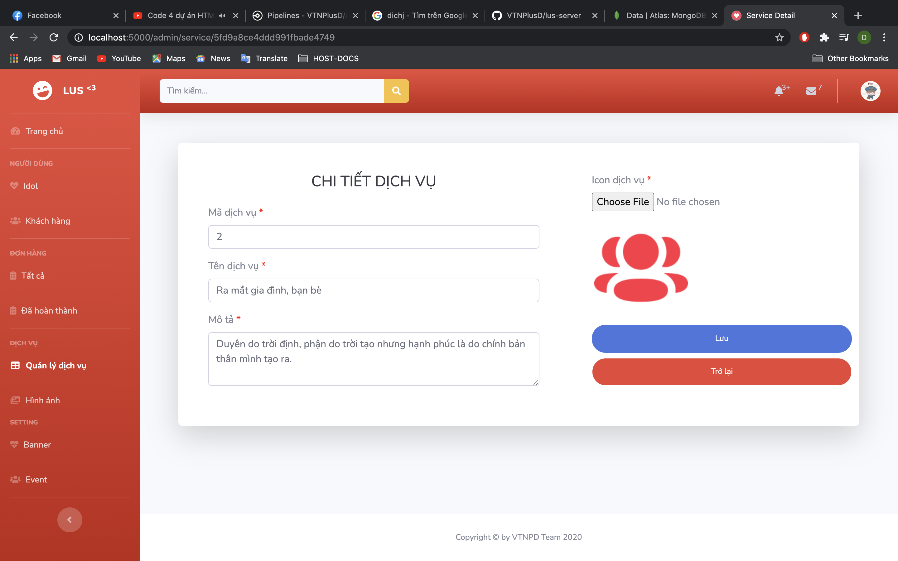 |
| 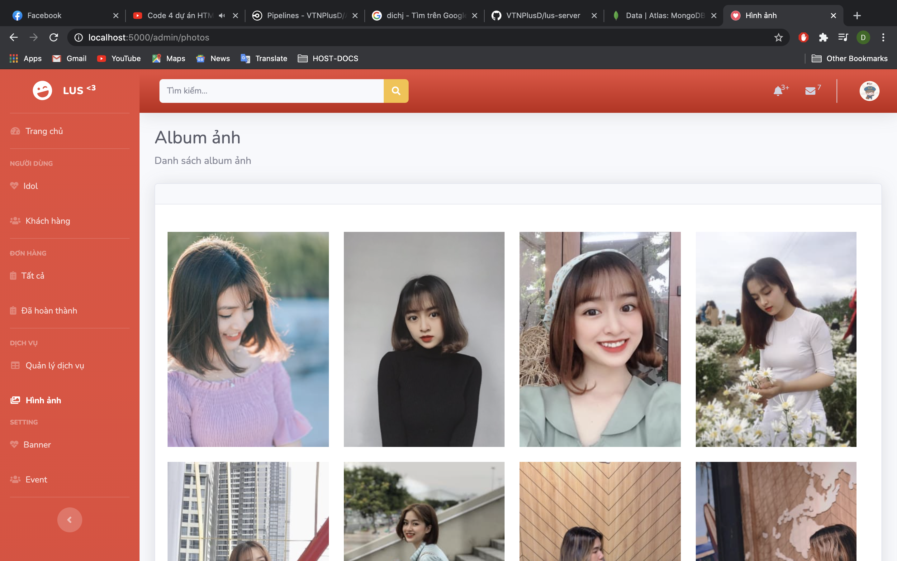
